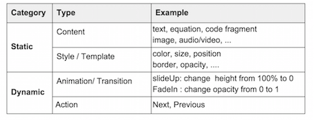

Introduction
========

Present System is a software packages used for providing visual presentation support 

Three major functions:

- An **editor** that allows contents to be inserted and manipulated
- A **method** for combining the basic elements into an  animated object in a specific form
- A **player** to display the object as a visual aid

Example -- Powerpoint

- A WYSIWYG editor 
- Contents are arranged into slides
- Styles and animations are set for sepate contents or a slide
- A presentation mode used to display slides with contents.

- **Content** elements are the raw materials
	- Plain Text, such as paragraphs, equation, list and table
	- Multimedia objects, or even some interactive plugin

- **Style** elements are similar to properties used in CSS to define style information for a webpage. 
	- A property in CSS is treated as an element in the model
	- Styles will be applied to content as attributes. 
	- A group of style elements make up a template and may be applied to a group of contents.

- **Animation** element is defined as changing from one specific style to another, or a group to another. 
	- A group of animation make up a transition
	- Animations are usually applied on one conent element
	- Transitions are applied on groups of content elements

- **Action** will trigger the application of animation and transition
	- Actions help the user to navigate through the content elements during delivering.

Task Model 
========

A task model describes the logical activities that have to be carried out in order to reach a goal. 

## The goal is to explain a topic via giving a presentation

## The tasks are the logical activies derived from the phases of the workflow proposed by MSRA	

**Planning** : to collect the materials (content elements)  of the presentation. 	

**Editing** : to relate the basic elements to others ( based on some rules)	

- Dividing the contents into groups means relating content to other content based on structural info
- Applying styles or templates means relating styles to contents

**Rehearsing** : to adjustthe relations according to the actual situation	

**Delivering** : to take actions to display the contents in the defined form	

**Sharing** : to display the contents with their original structure in a different form

## The roles of user are different in different phases. 

- The role in Former three phases is **author**.
- Last two phases has two roles: one is the **presenter**, and the other is the **audience**.

Layered Model 
========

## The layered model is derived from the task model 

It uses the basic elements to describe the logical activits in a more detailed level. 

The relationship between layers of model and phases of task model is not one-to-one.

An user may work on multiple layers to complete the task in one phase.

The implementation of one layer can affect the usability of different phases. 

## Content Layer ##

How to collect the content elements is a basic issue in this layer. 

- Directly copy and paste 
- Import from other source

Only content elements are provided by the user.

- All the other element are provided by the system
- Support to create new elements by combining the ones provided by the system.

## Structure Layer ##

How the structure information are described and kept in different phases should be considered in this layer.

Inherent structural information

Customized structural information

 
## Decoration Layer ##

How to apply the style to content should be considered in this layer.

Template is widely used to simplify the way to apply styles.

## Animation layer ##

How to relate the animation to contents should be considered in this layer. 

Relate animation to a specific content element, so what relation the user sets are exactly the final effect the content will be presented. 

Related to the content in an abstract way: setting some rules about which group of the contents the animation will be applied to and when they will be applied. 

Some unique animation can help a present system provide some special features in different layers. 

## Navigation Layer ##

Set actions in this layer to trigger the application of animation 

Help the user to navigate through the content elements. 

## Context Layer##

Factors that do not belong to the animated object, but may also influence the final dispaly effect

E.g., Display screen size, Delivery time, Delivery purpose

PowerPoint's Shortcommings
========

Inevitable Linearity

- Structure Layer
- Planning and Authoring Phase

Fix Size

- Structure Layer
- Decoration Layer
- Authoring Phase

Strictly Sequentiality

- Structure Layer
- Navigation Layer
- Delivery Phase

Design Principle
========

For easy planning, the system may provide some tools for collecting contents

- Import from some formated soucre
- Recommend some related items

For easy editing, template may be used for combing different elements

- Design Templates based on the inherent structure of the contents
- Allow to apply style templates on a group of contents in same level
- Provide layout template for arranging the contents in a canvas

## For better delivering, structure may be used for defineing new actions or providing meanfuling combination method

Prezi support dynamic navigation via Smart Zooming based on frames

- Frame is a customized struture unit
- Click an object to Zoom in : Prezi finds the best possible view for the clicked specific object
- Press 'Down' to Zoom out :  Prezi focus on the closest frame that is larger than the frame currently in focus. 

Beamer can generate some slides with structural information based on its tags

Conclusion
========

Primary works 

- Summary the basic elements
- Propose a task model to descibe the logical activies of present system
- Propose a layed model to explain the mechanism of present system

Contribution of the two models

- Help to discuss the differences between various present systems clearly
- Help to propose some design principles
- Simplify the way to implement or improve features of the present system

